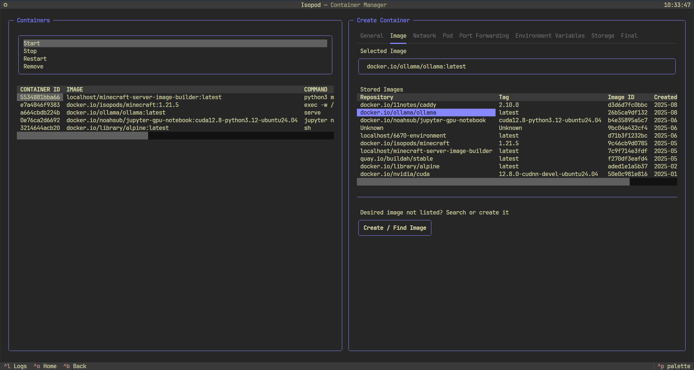
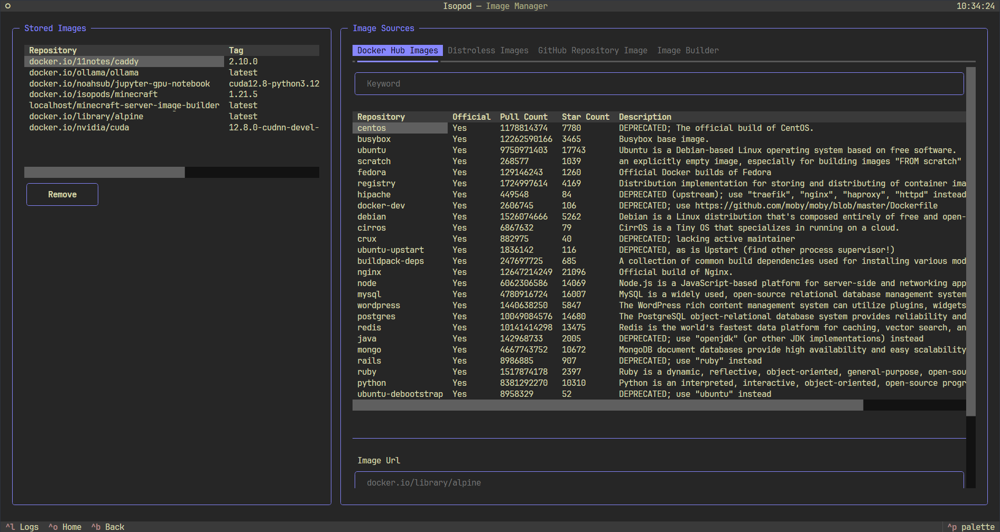

<p align="center">
  
</p>


<p align="center">
    <a href="https://www.python.org/"></a>
    <a href="https://github.com/Textualize/textual"></a>
    <a href="https://podman.io/"></a>
</p>

<p align="center">
    <a href="https://github.com/psf/black"></a>
</p>

<h1 align="center">Isopod</h1>

<p>
A CLI tool designed to ease the creation and management of secure and isolated Podman containers. This application is still in development and has not yet reached a stable release. 
</p>

## Gallery

<p align="center">
  
  
</p>

## Installation
```bash
git clone https://github.com/noahsub/Isopod.git
cd Isopod
python3 -m venv .venv
source .venv/bin/activate
pip install uv
uv pip install -r requirements.txt
python3 main.py
